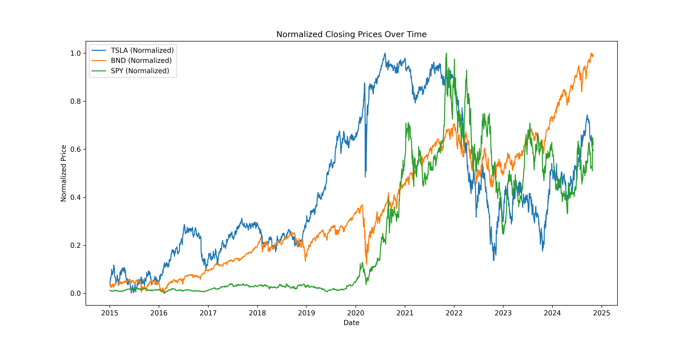
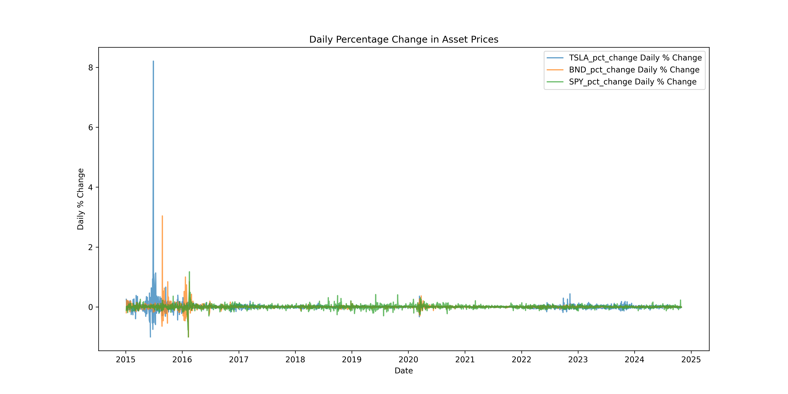
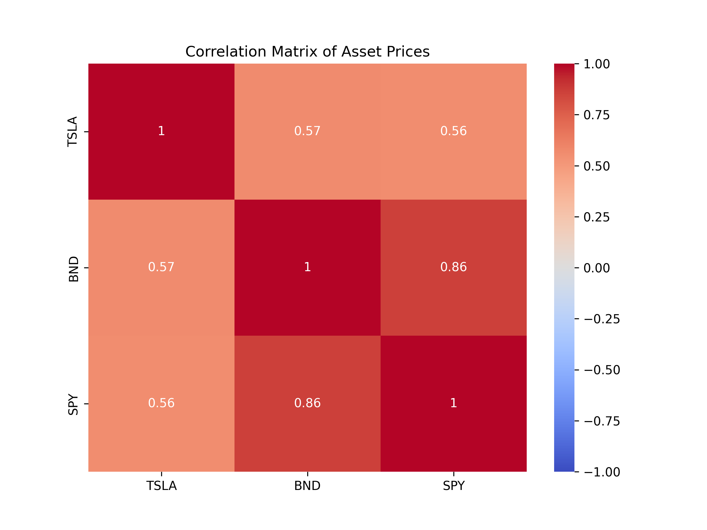
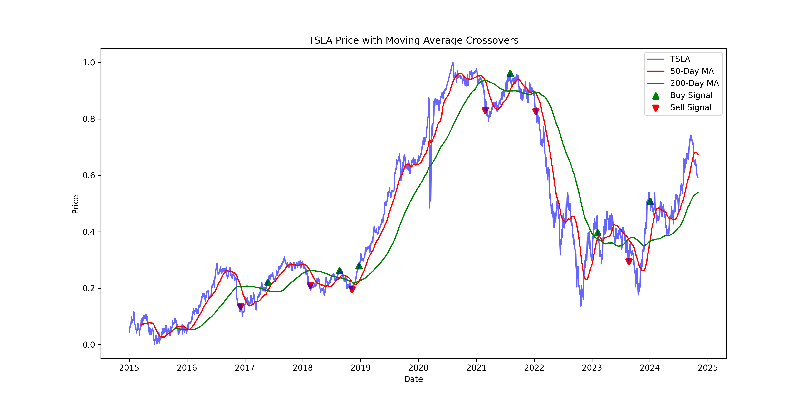
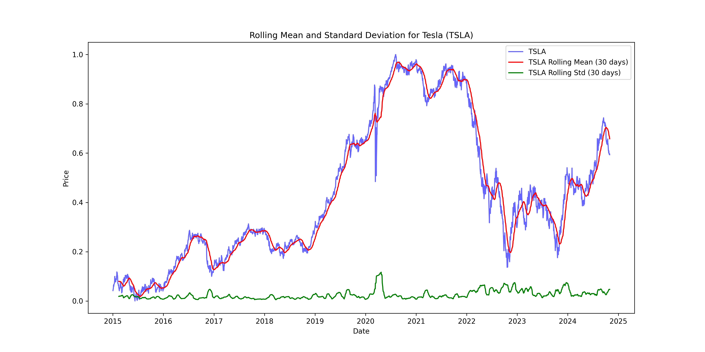
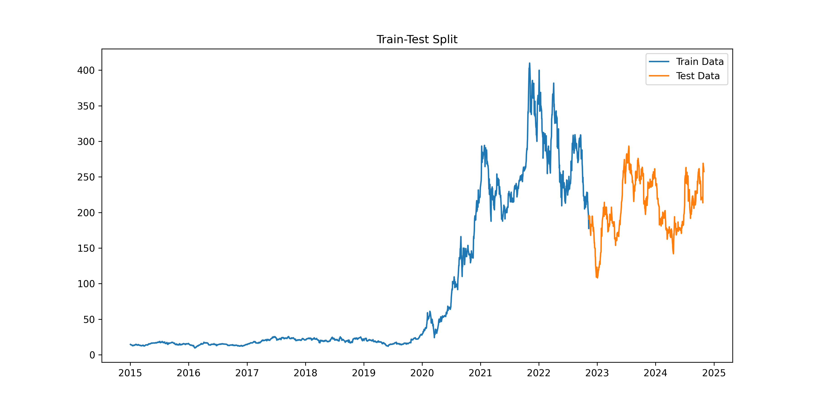
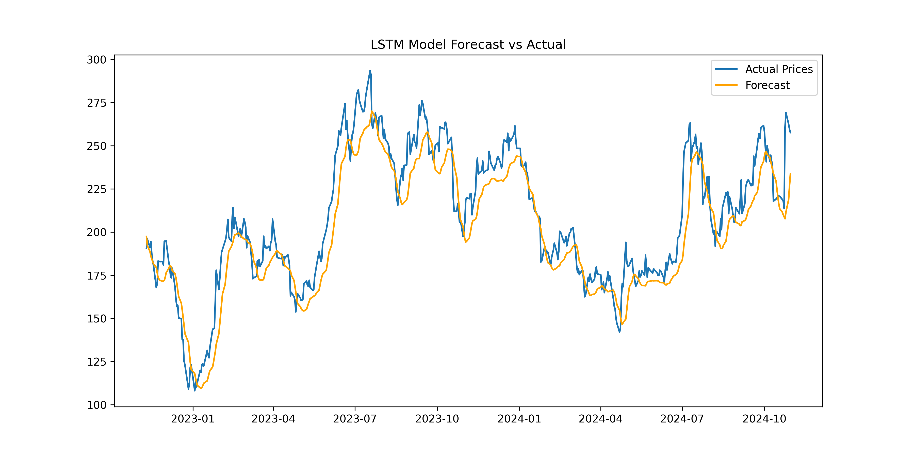
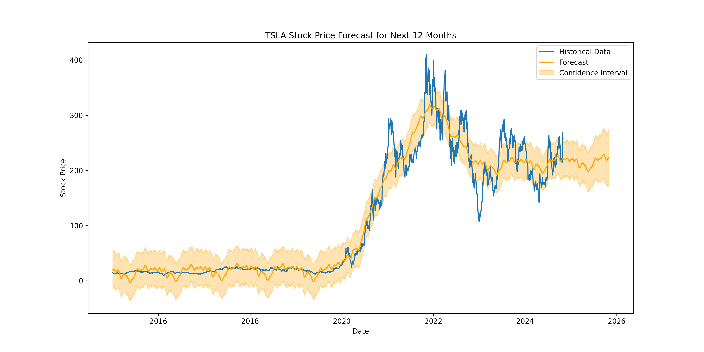
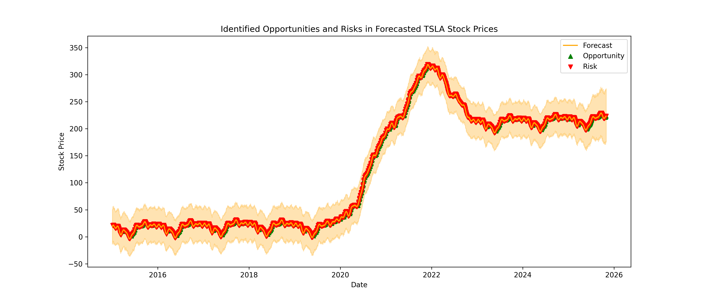
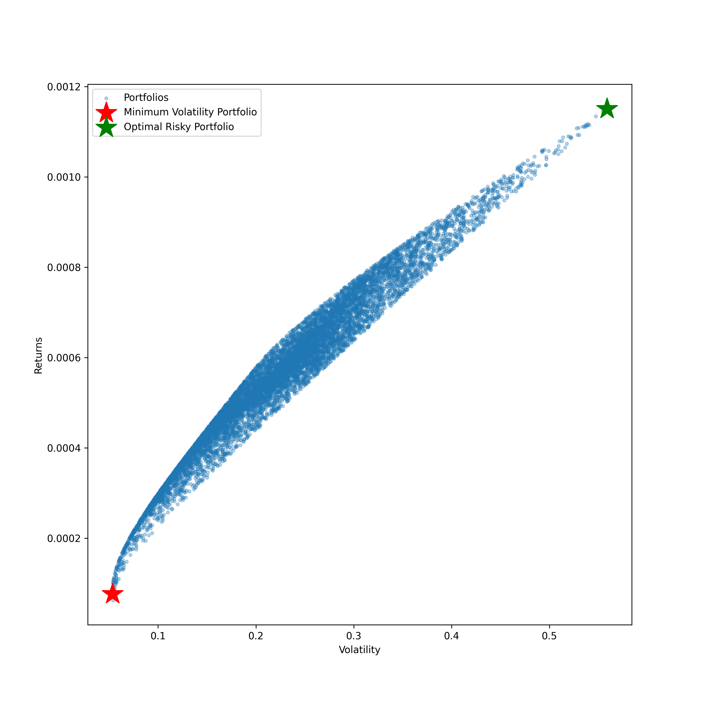

Here’s your project overview with a cooler tone and fun emojis, along with your name and socials added:

---

# 📈 **KAIM Week 11 Challenge - Time Series Forecasting for Portfolio Management Optimization**

This project is all about **enhancing portfolio management** strategies for **Guide Me in Finance (GMF) Investments** by **leveraging time series forecasting** models! 🚀 By predicting **future stock prices**, **market trends**, and associated **risks**, we provide **data-driven insights** to optimize **asset allocation**, **boost returns**, and manage risks with precision! 💡📊

---

## 🎯 **Objectives**

- **Preprocess and Analyze** historical financial data for key assets.
- **Develop and Evaluate** time series forecasting models (ARIMA, SARIMA, LSTM) to predict **Tesla's (TSLA)** stock prices.
- **Forecast Market Trends** and evaluate their impact on portfolio strategy.
- **Optimize a Portfolio** using the forecasted data to maximize returns and minimize risks! 💼💰

---

## 📊 **Data Sources and Assets**

Data was sourced using the **YFinance** Python library for the period **January 1, 2015 - October 31, 2024** from the following assets:

- **📌 Tesla (TSLA)**: A high-risk, high-reward stock 🚗⚡
- **📌 Vanguard Total Bond Market ETF (BND)**: Stability and low risk 💵
- **📌 S&P 500 ETF (SPY)**: Moderate-risk market exposure 📈

The dataset includes daily metrics like **Open**, **High**, **Low**, **Close**, **Adjusted Close**, and **Volume**.

---

## 🛠️ **Project Structure**
```
├── data/
│   ├── raw/
│   └── processed/
├── figures/
├── scripts/
│   ├── main.py
├── notebooks/
├── src/
│   ├── data/
│   │   ├── data_loader.py
│   │   ├── data_preprocessing.py
│   │   └── train_test_split.py
│   ├── eda/
│   │   ├── price_analysis.py
│   │   └── trend_analysis.py
│   ├── forecasting/
│   │   ├── arima_model.py
│   │   ├── lstm_model.py
│   │   └── sarima_model.py
│   │   ├── prophet_model.py
│   │   └── model_evaluation.py
│   ├── portfolio/
│   │   ├── optimization.py
│   │   └── performance_metrics.py
│   ├── utils/
│   │   ├── time_utils.py
│   │   └── yfinance_loader.py
├── tests/
├── README.md
└── requirements.txt
```

---

## 🚀 **Steps and Key Insights**

### **Task 1: Preprocess and Explore the Data**
- **Data Cleaning**: Handled missing values and ensured all columns were typed correctly ✅
- **Exploratory Data Analysis (EDA)**:
  - Visualized **historical closing prices** 📉.
  - Calculated **daily percentage changes** to analyze **volatility** ⚡.
  - Identified key **anomalies** 🔍.
  
**Key Insights**:  
- TSLA showed high volatility and huge returns 🔥.
- BND was a rock for stability 🧘‍♂️.
- SPY balanced risk and reward ⚖️.

---

### **Task 2: Develop Time Series Forecasting Models**
- **Model Selection**: We chose **ARIMA**, **SARIMA**, and **LSTM** models for forecasting 📊.
- **Evaluation Metrics**: 
  - **MAE**: Mean Absolute Error 📉
  - **RMSE**: Root Mean Squared Error 📏
  - **MAPE**: Mean Absolute Percentage Error 🧮

**Result**: SARIMA nailed it for **Tesla’s stock prediction** 🎯!

---

### **Task 3: Forecast Future Market Trends**
- **Forecast Generation**: SARIMA model for **12-month** Tesla forecast 📅.
- **Risk Insights**: Forecasts showed increased volatility 🌀, advising caution for high-risk investments ⚠️.
- **Opportunities**: Projected price increases 🚀 and balanced asset allocation!

---

### **Task 4: Optimize Portfolio Based on Forecast**
- **Portfolio Construction**: TSLA, BND, SPY 🏗️.
- **Risk & Return**: Calculated annual returns, covariance, and portfolio optimization 📈.
- **Sharpe Ratio**: Maximized returns relative to risk 💥.
- **Final Recommendation**: Increase BND allocation, balance with SPY to reduce TSLA volatility ⚖️.

---

## 📦 **Usage**
To execute the project pipeline:

```bash
git clone https://github.com/tedoaba/KAIM-W11.git
cd KAIM-W11

python -m venv venv
source venv/Scripts/activate

pip install -r requirements.txt

cd scripts

python main.py
```

---

## 📸 **Visualizations**
- **Normalize Price**: 📉 Normalized price
- **Daily Price Change**: 📈 Daily change
- **Correlation Matrix**: 🔍 Correlation matrix
- **Moving Average Crossover**: 📊 Moving average
- **Rolling Stats**: 📊 Rolling statistics
- **LSTM Forecast**: 🤖 LSTM forecast
- **Prophet Forecast**: 🌟 Prophet forecast
- **Trend Volatility**: 📉 Trend volatility
- **Opportunities & Risks**: 💡 Opportunities and risks
- **Portfolio**: 💼 Portfolio analysis
Visualizations
Normalized Price:



Daily Price Change:



Correlation Matrix:



Moving Average Crossover:



#### Rolling Stats



#### Train-Test Split



#### LSTM Forecast



#### Prophet Forecast



#### Trend Volatility


#### Opportunities and Risks



#### Portfolio



---

## 🚀 **Future Improvements**
- **Expand Asset Classes**: Add more stocks, commodities, and ETFs 🏠
- **Hybrid Models**: Experiment with ensemble techniques for even better predictions 🤖
- **Risk Metrics**: Incorporate **Conditional Value at Risk (CVaR)** for enhanced protection 🛡️

---

## 👨‍💻 **Authors**
This project was completed by **Tadesse Abateneh** 🚀.

For more info or collaboration, feel free to reach out! 👇

- **GitHub**: [Yonas Bogale Sitotaw](https://github.com/jonnahjr)  
- **LinkedIn**: [Yonas Bogale Sitotaw](https://www.linkedin.com/in/yonas-bogale)  
- **Twitter**: [@Yonas_Bogale](https://twitter.com/jonnahjr)  
- **Medium**: [Yonas_Bogale](https://medium.com/@yonas_bogale)

---

**Let’s forecast the future 📈 and make smart portfolio decisions! 💼**
